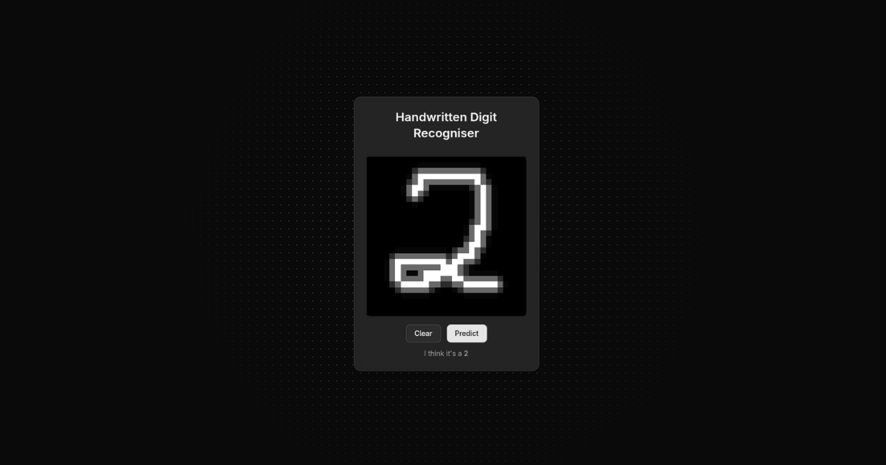
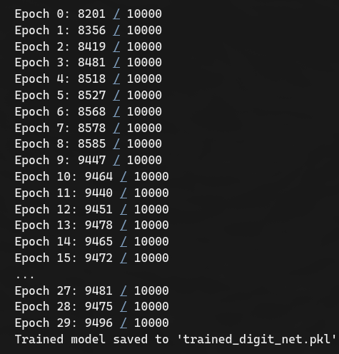
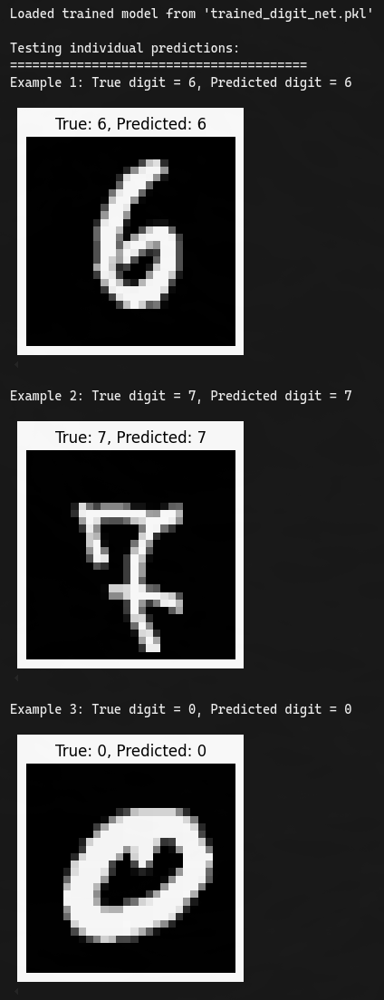

### Handwritten Digit Recogniser

> 7 September 2025 — Portfolio project by Zdravko Danailov



### TL;DR

From-scratch neural network trained on MNIST in Python, exported to JSON, and run in a Next.js web app where you draw a digit (0–9) on a 28×28 grid. The browser does a forward pass with the trained weights to predict the digit. Live demo on Vercel: [handwritten-digit-recogniser.vercel.app](https://handwritten-digit-recogniser.vercel.app/)

### Highlights

- **From-scratch NN**: Implemented feedforward, SGD, and backpropagation in Python.
- **Trained on MNIST**: ~95% test accuracy for a simple `[784, 30, 10]` network.
- **Portable model**: Weights/biases exported to JSON and loaded client-side.
- **Fast UI**: Next.js + TypeScript + Tailwind with a 28×28 drawing grid and brush smoothing.
- **Mobile-friendly**: Touch handling with passive=false and pointer/touch event fixes for iOS/Android.
- **Preprocessing**: Thresholding, centring, and slight scaling improve prediction stability.

### Architecture

- **Python training** (MNIST): see `neural-networks-and-deep-learning/src/` and helpers like `mnist_loader.py`.
- **Model export**: Serialise sizes/weights/biases to JSON → `web-app/public/trained_digit_net.json`.
- **Frontend inference**: TypeScript port of `feedforward` in `web-app/src/app/lib/network.ts` loads the JSON and predicts in-browser.

```
Repo Root
├─ neural-networks-and-deep-learning/        # Python NN + MNIST helpers
├─ web-app/                                  # Next.js (frontend)
│  ├─ public/trained_digit_net.json          # Exported model
│  └─ src/app/lib/network.ts                 # TS network (feedforward only)
└─ trained_digit_net.pkl                     # Trained Python model (for reference)
```

### Demo

- **Live**: [handwritten-digit-recogniser.vercel.app](https://handwritten-digit-recogniser.vercel.app/)
- **Tip**: Draw your digit large so it fills the square for best accuracy.

### Running the Web App (Next.js)

Prerequisites: Node 18+ (or 20+), and either PNPM, NPM, or Yarn.

```bash
cd web-app
pnpm install    # or: npm install / yarn
pnpm dev        # or: npm run dev / yarn dev
# open http://localhost:3000
```

The app loads `public/trained_digit_net.json` at runtime. If you retrain the model, re-export and overwrite this file.

### Optional: Train the Model in Python

Prerequisites: Python 3.10+, `pip`.

```bash
cd neural-networks-and-deep-learning
python -m venv .venv && source .venv/bin/activate
pip install -r requirements.txt
# Train using your script/notebook, then save as .pkl
```

Export the trained model to JSON for the web app (example sketch):

```python
import json, pickle

with open('trained_digit_net.pkl', 'rb') as f:
    data = pickle.load(f)

json_data = {
    "sizes": data["sizes"],          # e.g. [784, 30, 10]
    "weights": data["weights"],      # list[list[float]] per layer
    "biases": data["biases"]         # list[list[float]] per layer
}

with open('../web-app/public/trained_digit_net.json', 'w') as f:
    json.dump(json_data, f)
```

Expected JSON shape used by the web app:

```json
{
  "sizes": [784, 30, 10],
  "weights": [[[...], ...], ...],
  "biases": [[[...], ...], ...]
}
```

### How Inference Works in the Browser

- The TS `Network` class loads the JSON and performs layer-by-layer matrix-vector multiplies with a sigmoid.
- The drawing grid produces a 784-length vector in [0, 1].
- A small **preprocess** step thresholds, recentres, and scales the digit to stabilise predictions.

### Notes on Preprocessing and Mobile

- **Preprocessing**: threshold → find bounding box → scale ~0.8 → centre into 28×28. This improves accuracy for off-centre or small drawings.
- **Touch handling**: native touch listeners registered with `{ passive: false }` and `preventDefault()` to avoid scroll/zoom interference while drawing.

### Screenshots




### Acknowledgements

- Michael Nielsen — “Neural Networks and Deep Learning” (great foundation and clean implementations)
- 3Blue1Brown — intuition-first explanations that inspired the approach
- MNIST dataset maintainers

### Licence

This project is licensed under the terms of the repository’s `LICENSE` file.


